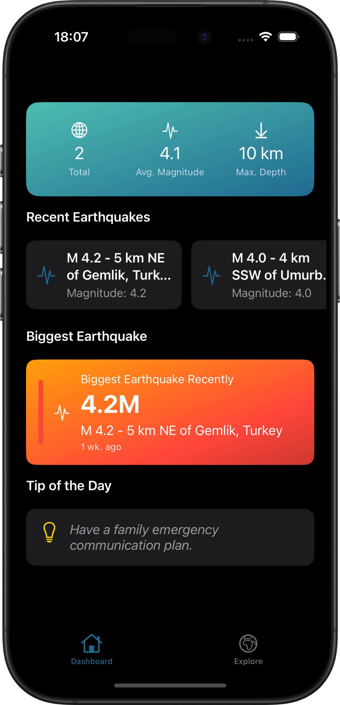
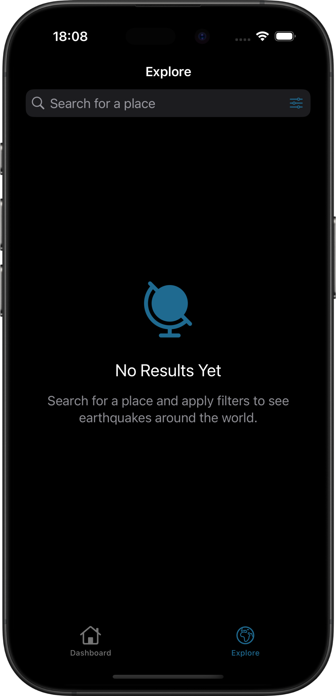
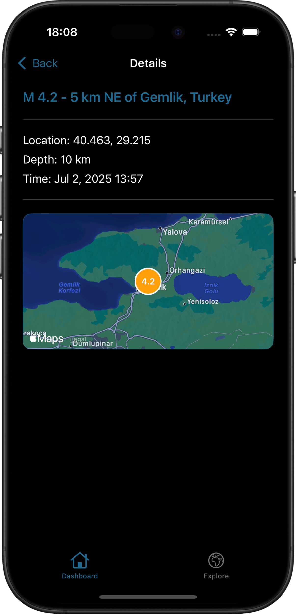
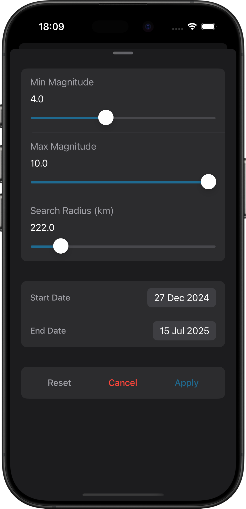
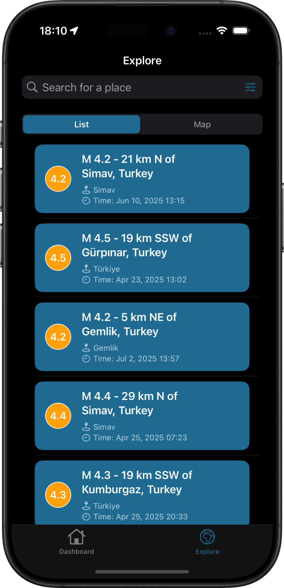
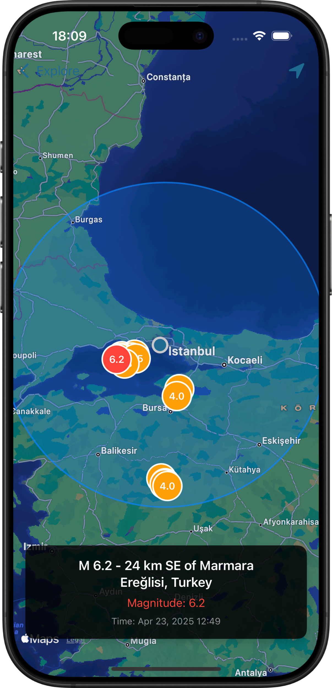

  

# Sismik

Sismik is a modular earthquake tracking application built with **UIKit**, **Clean Architecture**, **MVVM-C**, and **Swift Package Manager**.

Designed as a production-grade iOS architecture showcase, Sismik emphasizes scalable feature modularization, reusable business capabilities, and robust navigation orchestration while delivering real-time earthquake discovery, filtering, and visualization experiences.

# Overview
SismikApp enables users to:
- Explore nearby earthquakes
- Search earthquakes by custom locations
- Filter earthquakes dynamically by:
  - Magnitude
  - Radius
  - Date range
- Visualize earthquake activity on an interactive map
- Inspect detailed earthquake insights
- Switch between multiple earthquake providers
- Experience modern, modular iOS engineering practices

# Preview

| Dashboard | Explore | Detail |
|---|---|---|
|  |  |  |

| Filter | List | Map |
|---|---|---|
|  |  |  |

# Key Architectural Highlights

If you are primarily exploring this project for engineering practices, architecture, and scalability, the following areas are particularly notable:

- Clean Architecture
- MVVM-C
- Feature-based modularization with SPM
- Coordinator Pattern
- Dependency Injection

### Feature-Based Modularization via Swift Package Manager

Each feature is isolated into independently maintainable modules.

Example:

- DashboardPresentation
  - Assembly
  - Coordinator
  - Controllers
  - ViewModels
  - Views
  - Helpers

This structure enables:

- Independent feature ownership
- Reduced module coupling
- Faster incremental builds
- Safer refactoring
- Better long-term maintainability

### Shared Business Capability Modules

Core business capabilities are separated into reusable modules:
- **EarthquakeDomain**: Entities, repository contracts, use cases
- **EarthquakeData**: Repository implementations and persistence
- **EarthquakeRemote**: DTOs, API services, request builders
- **CoreNetworking**: Generic networking infrastructure
- **LocationServices**: Location and geocoding abstractions
- **EarthquakeSupport**: Shared formatting and utility components

### Navigation Architecture

Navigation is managed through hierarchical coordinators:
- AppFlowCoordinator
- OnboardingFlowCoordinator
- MainTabFlowCoordinator
- DashboardFlowCoordinator
- ExploreFlowCoordinator
- EarthquakeDetailFlowCoordinator
- MapFlowCoordinator
- LocationAccessFlowCoordinator

Includes:
- Cross-feature routing
- Child coordinator lifecycle cleanup
- Navigation stack tracking
- Modal dismissal tracking
- Concurrent transient flow management

### UIKit + Combine Modernization

SismikApp demonstrates:
- UIKit-first architecture
- Combine-driven state management
- Diffable data sources
- Compositional layouts
- Clean migration from legacy structures toward scalable production patterns

---

# Technologies
- UIKit
- Combine
- Swift Package Manager
- MapKit
- CoreLocation
- Diffable Data Source
- Compositional Layout

---

# Earthquake Providers

The application currently supports:
- USGS Earthquake API
- EMSC Earthquake API

The provider layer is designed to support future integrations with minimal impact on upper architectural layers.

---

# Localization
Supported languages:
- English
- Turkish

---

# Requirements
- iOS 17.0+
- Xcode 16+
- Swift 6

---

# Branching Strategy

| Branch | Description |
|---|---|
| main | Production-ready releases |
| develop | Active development |
| feature/* | New features |
| fix/* | Refinements and bug fixes |
| docs/* | Documentation improvements |

---

# License
MIT License
